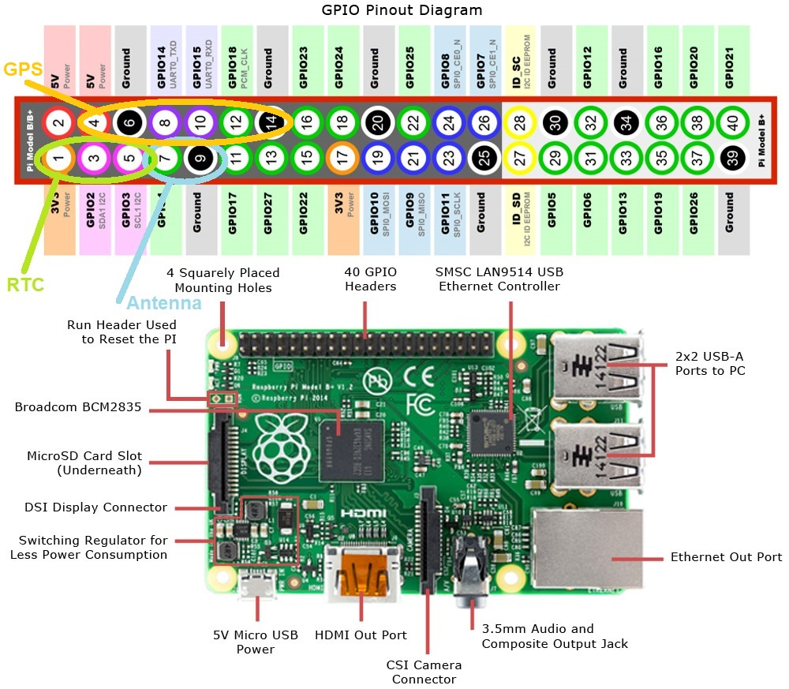

# README

## PiFunk Radio Transmitter - in FM/AM for HAM-bands

**Early Experimental!**

based on PiFM/AM-Scripts
___

### Preparations:

get this program via:

`git clone https://github.com/silicator/PiFunk`

1-Wire by default BCM4 setting needs to be activated in boot-config for autostart

via command: `sudo modprobe w1-gpio,gpiopin=4`

Using w1-gpio sometimes needs a 4.7 - 10 kΩ pullup resistor connected on GPIO pin

(if you have problems deactivate 1-wire config!)

manually open with nano-editor: `sudo nano /boot/config.txt` (i provide one too)

add line: `dtoverlay=w1-gpio,gpiopin=4,pullup=0` (add pullup=1 if needed)
___

### Build:

First update & upgrade system:

`sudo apt update` for system updates

`sudo apt upgrade` for system upgrades

You will need some libraries for this:

`sudo apt-get install libsndfile1-dev`

`sudo apt-get install python-dev python3-dev` for py3

[RPi-lib](https://pypi.org/project/RPi.GPIO/) (I use v0.6.5 from Nov 2018, also in repo)

`sudo pip-3.7 install RPi.GPIO` for Py3 (easiest way)

`sudo pip install RPi.GPIO` for Py2

or alternative ways: `sudo apt-get -y install python3-rpi.gpio`

`wget https://pypi.python.org/packages/source/R/RPi.GPIO/RPi.GPIO-0.6.5.tar.gz`

then extract `tar -xvf RPi.GPIO-0.6.5.tar.gz` and install it

then go to directory:

`cd PiFunk` with default path: `/home/pi/PiFunk`

compile with:

GNU installer `sudo apt-get install gcc`

`-g` for debugger informations (optional 0-3 optimalization level)

`-Wall` for debug warning informations

`-std=c99` (sometimes gnu99) for C99-standard

`-lm` for math-lib is obligatory!

`-Iinclude ` for using include-directory with headerfiles

`-Llib` for using library-directory

`-lsndfile` for ALSA "snd"-lib

`-c` for compiling without linking

`-fPIC` for generating position independent code (PIC) 

`-shared` for generating shared libraries

`-o` for output-filename

commands:

manually generating libraries:

`gcc -g -Wall -std=c99 -lm -Iinclude -Llib -c -fPIC pifunk.c -shared -o lib/pifunk.o lib/pifunk.s lib/pifunk.so lib/pifunk.a lib/pifunk.lib include/pifunk.i`

manuallygenerating executable binary:

`gcc -g -Wall -std=c99 -lm -Iinclude -Llib -lsndfile -fPIC pifunk.c -shared -o bin/pifunk.out bin/pifunk`

 optional:
`sudo make` with pre-configured flags for compilation

`sudoo clean` for removing .o files if neccessary

___

### Usage:

run with admin/root permissions:

Arguments: `[-n <filename (.wav)>] [ -f <freq (MHz)>] [-s <samplerate (kHz)>] [-m <modulation (fm/am)>] [-c <callsign (optional)>] [-p <power 0-7)>]`

extra single Arguments: -> no further argument needed

`[-a]` for assistent in step-by-step

`[-h]` for help with more infos and arguments

Use '. dot' as decimal-comma separator!

default: `sudo ./pifunk -n sound.wav -f 446.006250 -s 22050 -m fm -c callsign -p 7`

Radio works with .wav-file with 16-bit @ 22050.000 [Hz] mono / 0.1-700+ MHz range.

CTSS-Tones for PMR can be found here [CTSS](ctsspmr.csv)

___

### Warnings:

- Use (original) power supply 10 W, 5V @ ~2 A or ~5 V/500 mA via miniUSB 2.0 or 5.5 V Pins possible)

- PWM on GPIO 4/Pin 7 @ 2-4 mA (50 mA max. on ALL pins or 16 per bank!!!)

(in example: Pi B+ v1.2 @ 700 MHz/512 MB RAM on ARM processor bcm2835-v1.55)

for more Specifications just visit [Adafruit](http://www.adafruit.com)

- Antenna should be grounded (PIN 9 right one next to GPIO4 

- You can try to smooth it out with a 1:X (3-9)-balloon if using long HF antenna

- Dummy-load: 1-100 W @ 50 Ohm "cement" or similar (alu) with cooler for testing

- For handling overheating use cooling-ribs with fan (5V DC/0.2A 20x20mm) 

- For transmission you should use tested Antennas!

- Tip: You could use just a copper wire for 2m/70cm-band or
other lambda(1/4)-antennas (17.5cm/6.9in for PMR)
___

### Disclaimer:

- Private Project! Work in Progress (WIP)

- I'm not a professional so **NO guarantees or warranty** for any damage or similar!!

- Usage at your **own risk** !!

- Check laws of your country first! Some Frequencies are prohibited or need a Ham-License!

- Pi operates with square-waves (²/^2)!! Use Low-/High-Band-Pass-Filters with C=10-100 pF dry (not electroytic) capacitors (C)
with solenoid chokes (B=10-50 uH) or resistors (R=10kOhm)/diodes to prevent transmission (TX) simultaneously on permitted frequencies!

* Help / Testers and Feedback always appreciated!

* Thank you and have fun!
___

### Links:

[GitPage](https://silicator.github.io/PiFunk/)

[Readme Guideline](README.md)

[Contribution Guideline](docs/CONTRIBUTING.md)

[Code of Conduct Guideline](docs/CODE_OF_CONDUCT.md)

[Copying Guideline](docs/COPYING.md)

[License Guideline](LICENSE.md) under Open-Source GPLv3.0

Would appreciate being named in the source.
