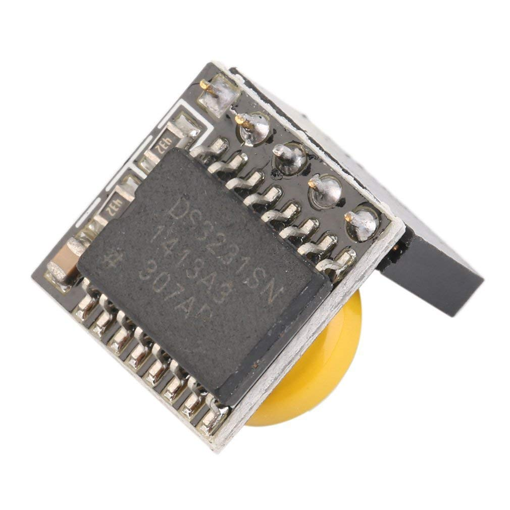
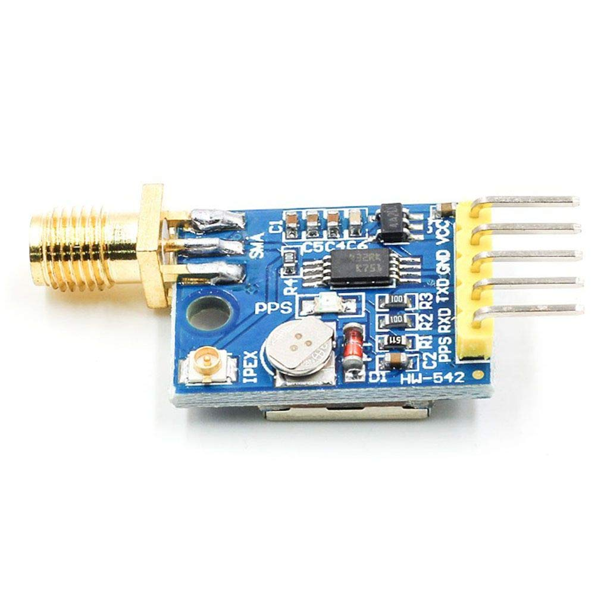

# README

## PiFunk Radio Transmitter - in FM/AM for HAM-bands

**Early Experimental!**

### Acknowledgements:
based on PiFM/AM-Scripts
___

### Preparations:

get this program via:

`git clone https://github.com/silicator/PiFunk`

1-Wire by default BCM4 setting needs to be activated in boot-config for autostart

via command: `sudo modprobe w1-gpio,gpiopin=4`

Using w1-gpio sometimes needs a 4.7 - 10 kΩ pullup resistor connected on GPIO pin

(if you have problems deactivate 1-wire config!)

manually open with nano-editor: `sudo nano /boot/config.txt` (i provide one too)

add lines:
`dtoverlay=w1-gpio,gpiopin=4,pullup=0` add pullup=1 if needed

optional:
`dtoverlay=i2c1-bcm2708` for I2C Bus
`enable_uart=1` for UART RX & TX
`dtoverlay=pps-gpio,gpiopin=18` Listen GPS 1 PPS signal for Pi Clock sync
`init_uart_baud=9600`

`sudo nano /etc/modules`

`pps-gpio` Add this line to the modulefile

Save your edits with ctrl-o <return/enter> then exit with ctrl-x
___

### Build:

First update & upgrade system:

`sudo apt update` for system updates

`sudo apt upgrade` for system upgrades

You will need some libraries for this:

`sudo apt-get install libsndfile1-dev`

`sudo apt-get install python-dev python3-dev` for py3

[RPi-lib](https://pypi.org/project/RPi.GPIO/) (I use v0.6.5 from Nov 2018, also in repo)

`sudo wget https://pypi.python.org/packages/source/R/RPi.GPIO/RPi.GPIO-0.6.5.tar.gz`

then extract `tar -xvf RPi.GPIO-0.6.5.tar.gz`

and install it

`sudo pip-3.7 install RPi.GPIO` for Py3 (easiest way)

or `sudo pip install RPi.GPIO` for Py2

or alternative ways: `sudo apt-get -y install python3-rpi.gpio`

`sudo reboot` then reboot to apply the changes

then go to directory:

`cd PiFunk` with default path: `/home/pi/PiFunk`

compile with:

GNU installer `sudo apt-get install gcc`

`-g3` for debugger informations (0-3 level, 2 is default)

`-Wall` for debug warning informations

`-v`	Print compilation infos

`-DRASPI2` defines the macro to be used by the preprocessor (here the PI model 1-4)

`-std=c99` (sometimes gnu99 or as iso -std=iso9899:1999) for C99-standard

`-lm` for math-lib is obligatory!

`-Iinclude ` for using include-directory with headerfiles

`-lsndfile` -l links libname for ALSA "snd"-lib

`-Llib` for using library-directory

`-c` for compiling without linking for making .o object

`-shared` for generating shared libraries

`-fPIC` for generating position independent code (PIC) for bigger programs

`-O3` for Optimization Stage 1-3 (memory, speed etc.) via compiler

`-o` for output-filename flag

commands:

manually generating libraries:

`sudo gcc -g -Wall -std=c99 -O3 -lm -Iinclude -Llib -lsndfile -c -fPIC pifunk.c -shared -o include/pifunk.i lib/pifunk.s lib/pifunk.o lib/pifunk.a lib/pifunk.lib lib/pifunk.so`

manually generating executable binary:

`sudo gcc -g -Wall -std=c99 -O3 -lm -Iinclude -Llib -lsndfile -fPIC pifunk.c -shared -o bin/pifunk.out bin/pifunk`

 optional:

`sudo make` with pre-configured flags for compilation

`sudo clean` for removing .o files if necessary

___

### Usage:

run with admin/root permissions:

Arguments: `[-n <filename (.wav)>] [ -f <freq (MHz)>] [-s <samplerate (kHz)>] [-m <modulation (fm/am)>] [-c <callsign (optional)>] [-p <power 0-7)>]`

extra single Arguments: -> no further argument needed

`[-a]` for assistant in step-by-step

`[-h]` for help with more infos and arguments

Use '. dot' as decimal-comma separator!

default: `sudo ./pifunk -n sound.wav -f 446.006250 -s 22050 -m fm -c callsign -p 7`

Radio works with .wav-file with 16-bit @ 22050.000 [Hz] mono / 0.1-700+ MHz range

CTSS-Tones (38 included) for PMR can be found here [CTSS](ctsspmr.csv)

___

### Warnings:

- Use (original) power supply 10 W, 5 V @ ~2 A or ~5 V/500 mA via miniUSB 2.0 or 5.5 V Pins possible)

- Antenna to GPCLK0 (GPIO 4, PIN 7) for PWM (Pulse with Modulation)
  @ 2-4 mA (max. 50 mA on ALL PINs and 16 per bank!)

- For transmission you should use tested/certified antennas with mounts (BNC/SDA/PL - m/f) if possible

 Tip: You could use just a copper wire for 2 m/70 cm-band or other lambda(1/4)-antennas (17.5 cm/6.9" in for PMR)

- Specifications: Pi 2B+ v1.2 @ 700 MHz/512 MB RAM on ARM processor with driver bcm2835-v1.55

  for more infos on other boards just visit [Adafruit](http://www.adafruit.com)

  or [Wikipedia Spec Summary](https://de.wikipedia.org/wiki/Raspberry_Pi)

- Antenna should be grounded (see Pinout image) to prevent noise and other problems

- You can try to smooth it out with a 1:X (3-9)-balun if using long HF antenna

- Dummy-load: 1-100 W @ 50 Ohm "cement" or similar (aluminium case) with cooler for testing

- For handling overheating use cooling-ribs with fan (5 V DC/0.2 A - 20x20 mm)

- RTC: Module DS3231 uses 3.3 V (PIN 1), SDA0 (PIN 3, GPIO0 on I2C), SCL0 (PIN 5, GPIO1 on I2C) & GND (PIN 9)

-> need to activate I2C in pi config! `sudo raspi-config`

- GPS: Module Neo 7M uses 5 V (PIN 4), GND (PIN 6), RX to UART-TXD (GPIO 14 PIN 8), TX to UART-RXD (GPIO 15, PIN 10), PPS to PCM_CLK (GPIO 18, PIN 12)

  it prints in NMEA format so change config `ttyAMA0` to `tty1`

  `sudo cat /dev/ttyAMA0` or alternative `sudo cat /dev/ttyS0`

-> need to activate UART (serial0) in pi config! Yes here crosswiring!! -> (RX of GPS receives what Pi TX'ed)

- Morsecode-table:

___

### Disclaimer:

- Private Project! Work in Progress (WIP)

- I'm not a professional so **NO guarantees or warranty** for any damage etc.!!

- Usage at your **own risk** !!

- Check laws of your country first! Some Frequencies are prohibited or need a Ham-License!

- Pi operates with square-waves (²/^2)!! Use Low-/High-Band-Pass-Filters with dry (not electrolytic) capacitors (C=10-100 pF)
  with solenoid toroid chokes (B=10-50 uH) or resistors (R=10 kOhm)/diodes to prevent transmission (TX) simultaneously on permitted frequencies!

* Help / Testers and Feedback always appreciated!

* Thank you and have fun 73!
___

### Links:

[GitPage](https://silicator.github.io/PiFunk/)

[Readme Guideline](README.md)

[Contribution Guideline](docs/CONTRIBUTING.md)

[Code of Conduct Guideline](docs/CODE_OF_CONDUCT.md)

[Copying Guideline](docs/COPYING.md)

[License Guideline](LICENSE.md) under Open-Source GPLv3.0

Would appreciate being named in the source.
